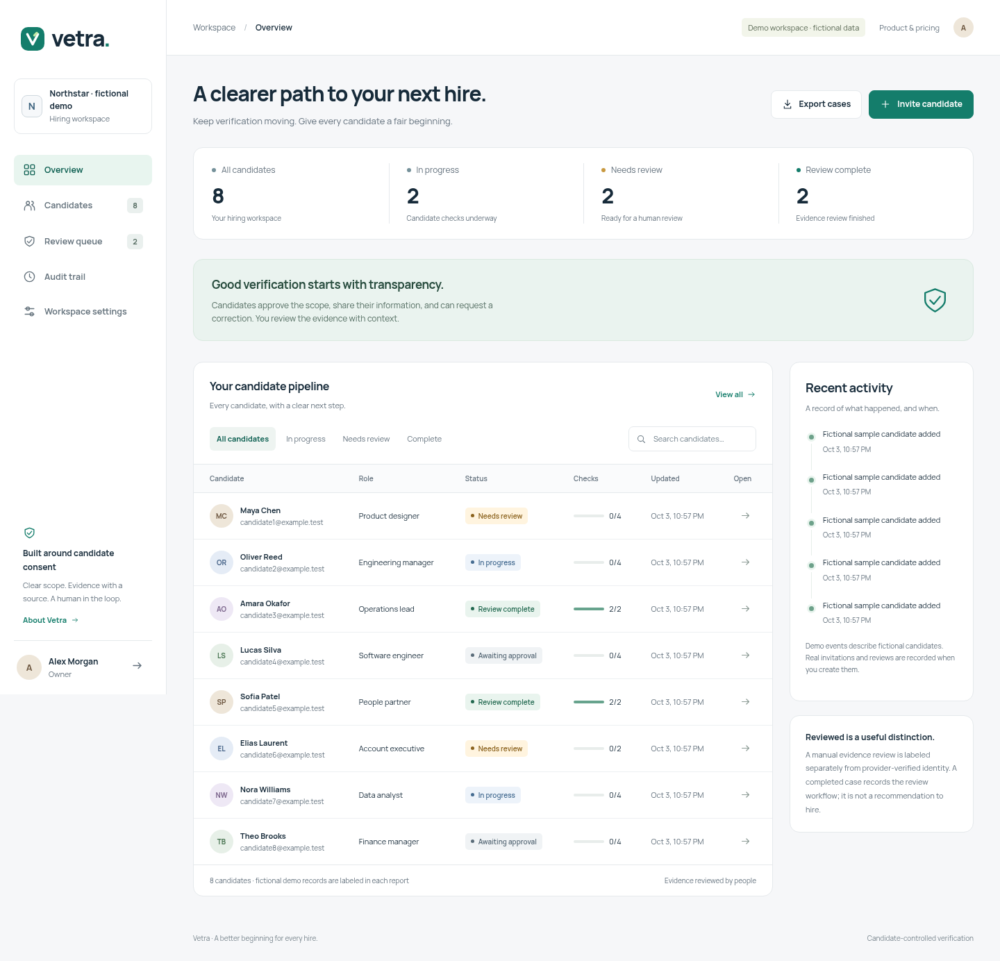

# Vetra

**Candidate-controlled verification for hiring teams.**

Vetra gives HR teams a clear workflow for candidate approval, scoped information collection, identity-provider checks, evidence review, corrections, and audit history. This is a paid-pilot foundation. The working brand needs domain and trademark clearance before commercial launch.



## Try the workspace

Python 3.10+:

```bash
python -m venv .venv
source .venv/bin/activate
pip install -r requirements-vetra.txt
python -m vetra --port 8000
```

Open **http://127.0.0.1:8000** for the HR workspace and **http://127.0.0.1:8000/about** for the product and pilot pricing page. Default demo mode uses clearly labeled fictional candidates, automatically signs in a local demo owner, and must bind to loopback. Use only sample information.

1. Create an invitation in the HR workspace.
2. Open its private candidate link in a separate browser session.
3. Approve the scope and submit a candidate statement.
4. Record a manual evidence review in the HR case.
5. Request and resolve a correction, or withdraw from the candidate portal.

Invitations are delivered by manually sharing the link; the app does not send email. New cases persist under `instance/`, which is excluded from Git.

## Implemented

| Capability | Current behavior |
|---|---|
| HR workspace | Responsive queue, search, filters, case detail, activity, audit and minimal CSV exports |
| Candidate portal | Expiring links, scoped approval, employment/education statements, selected professional profiles, correction and withdrawal |
| Staff access | Password hashing, login throttling, owner/reviewer/viewer roles and server-enforced tenant boundaries |
| Identity verification | Stripe Identity adapter, hosted sessions, idempotency, signed callbacks and recorded provider outcomes; activation required |
| Evidence review | Named source and notes, explicitly labeled **Manually reviewed** |
| Withdrawal | Revoke invitations, remove candidate details, stop checks and request provider cleanup |
| Security foundation | CSRF protection, security headers, scoped queries, hashed tokens and safe CSV cells |
| Partner notifications | Reused MIT Standard Webhooks verifier, tenant-bound deliveries, replay deduplication and notification-only audit |

**Review complete** describes completion of the workflow. It is not a hiring recommendation. Statements and manual reviews never become provider-verified identity by changing a label.

## Connect real verification

See [Provider integrations](docs/business/PROVIDER-INTEGRATIONS.md) for configuration and callback validation. Stripe API/webhook secrets, account activation and an HTTPS public URL are required. Fictional seeded candidates cannot be sent to a real provider.

Employment, education, criminal records, sanctions, credit and right-to-work checks require contracted data sources and jurisdiction-specific procedures. These background-check providers are **not connected**. Identity verification alone is not a complete AML/KYC program or employment background report.

## Pilot deployment

Configure the variables in [.env.vetra.example](.env.vetra.example), use a separate database, and set `VETRA_DEMO=false`. The factory refuses missing stable secrets, missing admin credentials, or a database containing demonstration candidates. The example file documents environment variables; the app does not read dotenv files.

[Dockerfile.vetra](Dockerfile.vetra) provides a non-root Gunicorn runtime with demo disabled. Supply secrets through the deployment platform, terminate HTTPS at a reverse proxy, and mount a writable database volume. Never expose the automatic-login demo publicly. SQLite is a single-instance pilot, not a horizontally scalable enterprise service.

See [Enterprise architecture](docs/business/ENTERPRISE-ARCHITECTURE.md) for Postgres, queues, SSO, provider contracts, retention, monitoring and validation needed before enterprise launch. No SOC 2, ISO 27001, GDPR or FCRA certification is claimed.

## Build the business

- [Launch plan](docs/business/LAUNCH-PLAN.md): buyer, offer, pilot economics and launch milestones.
- [Sales kit](docs/business/SALES-KIT.md): discovery questions, demo script, pilot proposal and outreach drafts.
- [Open-source component review](docs/business/OSS-COMPONENTS.md): inspected repositories, licenses, components and limitations.
- [Provider integrations](docs/business/PROVIDER-INTEGRATIONS.md): actual behavior and activation requirements.

## Tests

```bash
pip install pytest
python -m pytest --noconftest tests/test_vetra*.py -q
```

`--noconftest` keeps the standalone suite independent of Maigret's larger dependency stack. Tests cover tenancy, roles, approval, candidate-link scope, withdrawal, export and provider state handling. GitHub CI runs these checks on Vetra changes.

## Attribution

This repository began as a fork of [Maigret](https://github.com/soxoj/maigret), the MIT licensed OSINT engine. Its copyright and [LICENSE](LICENSE) are retained. The original README is in [docs/upstream/MAIGRET-README.md](docs/upstream/MAIGRET-README.md). The `maigret` Python package and CLI remain compatible; the new `vetra` app runs separately and does not expose username discovery or AI profiling to HR users.

Public account matches do not establish identity, ownership, criminal history, employment eligibility or suitability. They are not verification evidence in Vetra.

Manrope is self-hosted under its [SIL Open Font License](vetra/static/fonts/OFL.txt). Reused modules retain their licenses and exact source provenance; see the component review.
