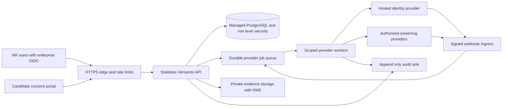

# Enterprise architecture and readiness

Verisento is currently a working local pilot: an HR interface and candidate portal,
Flask application, SQLite storage, workspace-scoped records, consent, audit entries,
manual evidence review, candidate corrections, and a Stripe Identity integration
foundation. Enterprise production readiness has not been established. There is no
SOC 2 report, ISO 27001 certificate, guaranteed SLA or connected background screening
network supplied by this repository.

## Deployment target

This diagram is a target architecture, not the current deployment. Use managed
PostgreSQL with encrypted storage and backups, tenant-aware constraints and row
level security. Keep the API stateless across replicas. Put external provider calls,
webhook processing, exports, cleanup and retention jobs behind durable queues with
bounded retries, idempotency, dead-letter handling, and reconciliation. Return
workflow state independently of long-running providers. Outbox/inbox records should
bridge application commits and queue delivery so a process crash cannot drop work.

Store necessary evidence in private object storage with tenant-bound access checks,
short-lived download URLs, malware scanning, encryption with managed KMS and a
documented key rotation process. Keep document images and biometrics at the identity
provider where possible. Never expose provider API keys or raw webhook bodies in
logs. Put secrets in a secret manager and grant each worker only its required scopes.

## Access and isolation

Replace the pilot's local account flow with enterprise OIDC/SAML, enforced MFA,
verified tenant membership and managed invitation provisioning. Define separate
roles for organization owner, recruiter, reviewer, compliance operator and support.
Restrict who can request checks, read sensitive reports, review evidence, make a
decision, export data or change retention policy. Support access should be
time-limited, auditable and approved by the tenant. Test cross-tenant access for all
API paths, files, searches, exports and asynchronous jobs. SQLite application
filters are useful for a pilot but do not establish independent database isolation.

## Screening and adjudication

Record check purpose, jurisdiction, policy version, disclosure and consent version,
source/provider, request identifiers and result timestamps. Map provider evidence
to a reviewable record without converting ambiguous matches into a hiring verdict.
Candidate notification, corrections and appeals must remain available. Decisions
need an identified human reviewer and a documented role-related policy; separate
identity verification from eligibility or suitability for a position. In regulated
employment screening, implement jurisdiction-specific notice, dispute and adverse
action procedures before selling affected checks. Legal review must determine the
business's and providers' obligations, permissible sources and product claims.

## Retention, deletion and recovery

Specify tenant retention defaults and justified exceptions per check and region.
Implement scheduled deletion across database records, files, providers, caches and
exports with completion evidence; enforce lawful holds explicitly. The pilot's
withdrawal flow suppresses reports and requests provider cancellation/redaction;
it is not a complete retention engine or guaranteed erasure service. Send cleanup
failures to durable retries and an operator queue rather than relying on a browser
request completing. Encrypt backups, test restores, document deletion behavior in
backups and measure recovery time and recovery point objectives.

## Operational controls

Use structured request and job IDs, metrics for queue age and provider failure,
signed webhook failures, review backlog, cleanup completion and tenant isolation
alerts. Forward security and decision audits to an append-only destination with
access separation and retention policy. The current database audit is mutable by
an administrator and must not be marketed as tamper-proof. Publish an incident
response process, provider outage procedures and status communication channels.
Add dependency inventory, secret scanning, change reviews, release signatures,
restore exercises and independent penetration testing before wider release.

## Release gates

| Area | Available in this implementation | Required before enterprise sale |
| --- | --- | --- |
| Product workflow | HR dashboard, invitation/consent portal, reviews and corrections | Accessibility and usability testing with HR and candidates; support processes |
| Tenant isolation | Tenant-scoped pilot queries and authorization checks | Postgres/RLS, complete isolation testing, scoped files/jobs and support access |
| Identity | Hosted document adapter; authenticated events; sample/live separation | Provider contract/account validation and approved end-to-end live verification |
| Background checks | Explicitly unavailable provider capabilities and manual evidence workflow | Authorized sources/providers, coverage, jurisdiction review, disputes and adjudication |
| Authentication | Pilot accounts and sessions | Enterprise SSO/MFA, role policy, provisioning and credential lifecycle |
| Availability | Single service/SQLite development runtime | HA database, replicas, durable queues, monitoring, incident response, backup/restore evidence |
| Privacy | Consent/withdrawal and basic report suppression | Retention engine, provider deletion confirmation, data inventory, DPA and subprocessors |
| Audit | Database workflow audit entries | Append-only external audit trail, export controls and incident evidence |
| Assurance | Offline unit/API tests | Load tests, independent security assessment and evaluated compliance program |

Start with a narrowly scoped, assisted pilot for identity and consented evidence
review in one jurisdiction. Publish the actual coverage and limits in contracts and
UI. Broaden check types only after the associated provider, source, review and
candidate recourse processes are operational.
